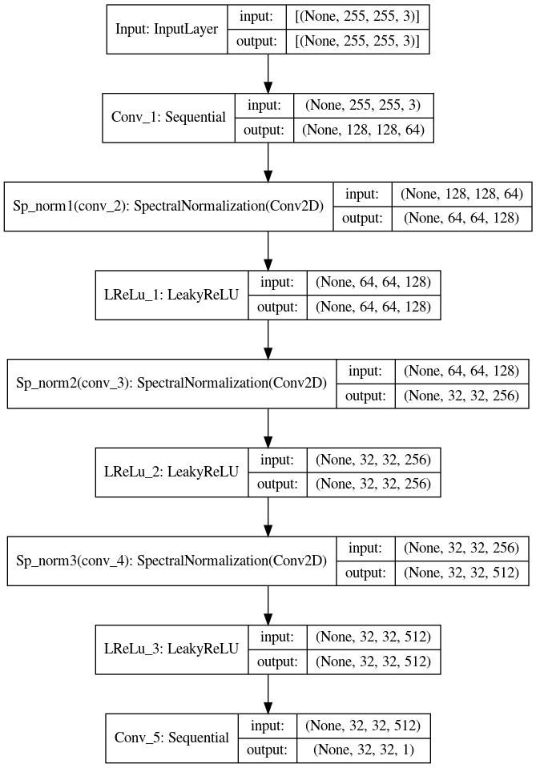

# Projet-bmdata
Projet de Big Multimédia Data effectué par Maëlle Gallois, Etienne Candelot, Xyléan Broeders, Théodore Rézel (basé sur [ce projet](https://github.com/hnjiakai/BeautyGAN) et [celui-ci](https://github.com/baldFemale/beautyGAN-tf-Implement)).

## Generator model

## Discriminator model

## TO DO :
### Préliminaires
- [ ] récupérer les données
- [ ] les pré-traiter

### Analyse du code
- [ ] lire le papier : README --> paper
- [ ] comprendre l'architechture générale du GAN
- [ ] analyser le GAN de tensorflow et le comparer avec le GAN du projet

### Implémentation
- [x] Chargement des données
- [ ] Pré-traitement des données
- [x] Generator
- [x] Discriminator
- [ ] Loss functions
### Executer le code
- [ ] Voir si ça compile
- [ ] Réussir le projet
